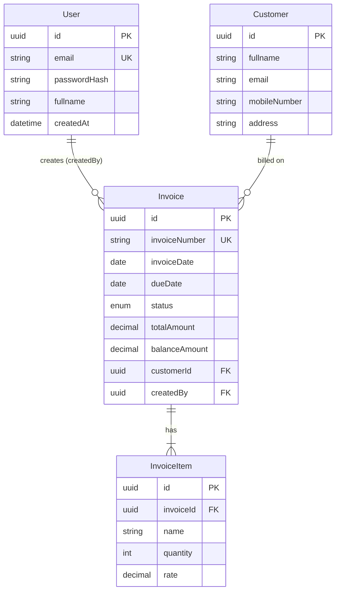

# 02 — Data model

Relational schema used by SimpleInvoice, how it maps to the assessment reference model and Appendix A, and the constraints that enforce business rules.

Source of truth in code: `backend/prisma/schema.prisma`.  
Product rules: [../use-cases/business-rules.md](../use-cases/business-rules.md).

---

## Entity overview



| Entity | Table | Purpose |
| ------ | ----- | ------- |
| `User` | `users` | Login identity; owns created invoices (`createdBy`) |
| `Customer` | `customers` | Bill-to party; separate table (assessment allows embed or separate) |
| `Invoice` | `invoices` | Header, amounts, persisted status, dates, currency |
| `InvoiceItem` | `invoice_items` | Line items; create UI writes one row; schema allows many |

**Cardinality:** one User creates many Invoices; one Customer appears on many Invoices; one Invoice has one or more InvoiceItems (create flow writes a single item).

All primary keys are **UUID** (`@db.Uuid`), generated by the backend (Prisma `@default(uuid())`), except where seed fixes known Appendix A ids.

---

## User

| Field | Type | Constraints / notes |
| ----- | ---- | ------------------- |
| `id` | UUID | Primary key |
| `email` | string | **Unique**; login identifier (stored lowercased on write paths) |
| `passwordHash` | string | bcrypt hash; never returned by API |
| `fullname` | string | Display name |
| `createdAt` | datetime | Set on create |

Seeded reviewer (for assessment access): `reviewer@101digital.io` — see root / backend README for password.

---

## Customer

Assessment §3.2 allows customer fields **embedded on Invoice** or a **separate table**. This project uses a **separate `customers` table**.

| Field | Type | Constraints / notes |
| ----- | ---- | ------------------- |
| `id` | UUID | Primary key |
| `fullname` | string | Required |
| `email` | string | Required; indexed; business key for create upsert |
| `mobileNumber` | string? | Optional |
| `address` | string? | Optional |
| `createdAt` / `updatedAt` | datetime | Audit |

**Create behaviour:** find customer by email (case-insensitive). If found, update name/mobile/address; otherwise insert. Invoice then references `customerId`.

Emails are indexed for lookup. Uniqueness of email is enforced in application upsert logic (one logical customer per email in normal create flows).

---

## Invoice

Aligns with assessment §3.1. API responses expose `invoiceId` as the invoice’s `id`.

| Field | Type | Constraints / notes |
| ----- | ---- | ------------------- |
| `id` | UUID | Primary key → API `invoiceId` |
| `invoiceNumber` | string | **Unique**; user-provided |
| `invoiceReference` | string? | Optional external reference |
| `invoiceDate` | date | Required |
| `dueDate` | date | Required; must be ≥ `invoiceDate` (validated in service) |
| `currency` | string | e.g. AUD, USD, GBP |
| `currencySymbol` | string | Display symbol derived at create (e.g. AU$) |
| `description` | string? | Optional |
| `status` | enum | **Persisted:** `Draft`, `Pending`, `Paid` only. Default `Draft` on create |
| `invoiceSubTotal` | decimal(12,2) | quantity × rate (server) |
| `totalTax` | decimal(12,2) | Server-calculated |
| `totalDiscount` | decimal(12,2) | Server-calculated |
| `totalAmount` | decimal(12,2) | Final payable |
| `totalPaid` | decimal(12,2) | Default `0` on create |
| `balanceAmount` | decimal(12,2) | `totalAmount − totalPaid` |
| `createdAt` | datetime | Set on create |
| `customerId` | UUID | FK → Customer |
| `createdBy` | UUID | FK → User |

**Indexes:** `invoiceNumber` (unique), `invoiceDate`, `dueDate`, `status`, `customerId` — support list search/filter/sort/pagination.

### Status vs display Overdue

| Stored (`InvoiceStatus`) | Display (API `status` field after mapping) |
| ------------------------ | ------------------------------------------ |
| Draft / Pending / Paid | Same, unless unpaid and `dueDate` &lt; today → **Overdue** |

`Overdue` is **never** a database enum value and is never written by seed or create.

---

## InvoiceItem

Aligns with assessment §3.3. Quantity is an **integer**; unit of measure is not modelled (Appendix A guidance).

| Field | Type | Constraints / notes |
| ----- | ---- | ------------------- |
| `id` | UUID | Primary key |
| `invoiceId` | UUID | FK → Invoice; **on delete cascade** |
| `name` | string | Required |
| `quantity` | int | Required; positive on create validation |
| `rate` | decimal(12,2) | Required; positive on create validation |

Assessment create flow persists **one** item; the table supports multiple rows for future extension.

---

## Money fields

Persisted amounts are produced by `backend/src/common/invoice-math.ts` using:

```text
subTotal      = quantity × rate
taxAmount     = subTotal × (tax% / 100)
totalAmount   = subTotal + taxAmount − discount
balanceAmount = totalAmount − totalPaid
```

Values are rounded to two decimal places. Tax % and discount are **inputs to create**, not separate invoice columns; results are stored in `totalTax` / `totalDiscount` / etc.

On create: `totalPaid = 0` → `balanceAmount = totalAmount`. Discount must not make `totalAmount` negative.

---

## Mapping to Appendix A

Appendix A is a **list payload shape**, not a 1:1 table dump. Seed and API mapping cover the same commercial fields:

| Appendix A / API concept | Storage |
| ------------------------ | ------- |
| `invoiceId` | `Invoice.id` |
| `invoiceNumber`, dates, currency, `currencySymbol`, `description`, `invoiceReference` | Invoice columns |
| Nested `customer` | `Customer` row + `customerId` |
| Nested `items[]` | `InvoiceItem` rows |
| Amounts (`invoiceSubTotal`, `totalTax`, …, `balanceAmount`) | Invoice decimals |
| `status: "Overdue"` in sample JSON | Display-only; seed stores a non-Paid persisted status with a past `dueDate` so reads show Overdue |
| `createdBy` | `User.id` (reviewer id fixed in seed to match sample) |
| `type`, `invoiceGrossTotal` | Not required columns; not modelled as first-class fields |

Seed also generates additional invoices (~30) with mixed Draft / Pending / Paid, dates, and amounts so list features are exercisable. Command: `npm run seed` in `backend/`.

---

## Integrity summary

| Rule | Enforcement |
| ---- | ------------ |
| Unique invoice number | DB `@unique` + service pre-check + `P2002` → 409 |
| Unique user email | DB `@unique` |
| Due date ≥ invoice date | Service validation on create |
| Status enum without Overdue | Prisma `InvoiceStatus` |
| Totals consistent | Written only via server `calculateInvoiceTotals` |
| Items removed with invoice | `onDelete: Cascade` on `InvoiceItem` |

---

## Related reading

- [01-architecture-and-stack.md](./01-architecture-and-stack.md)  
- [../use-cases/business-rules.md](../use-cases/business-rules.md)  
- [../use-cases/UC-04-create-invoice.md](../use-cases/UC-04-create-invoice.md)  
- Live API shapes: Swagger `/api/docs`  
